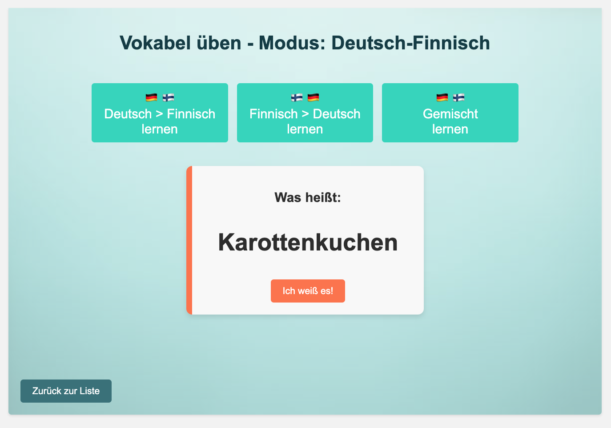
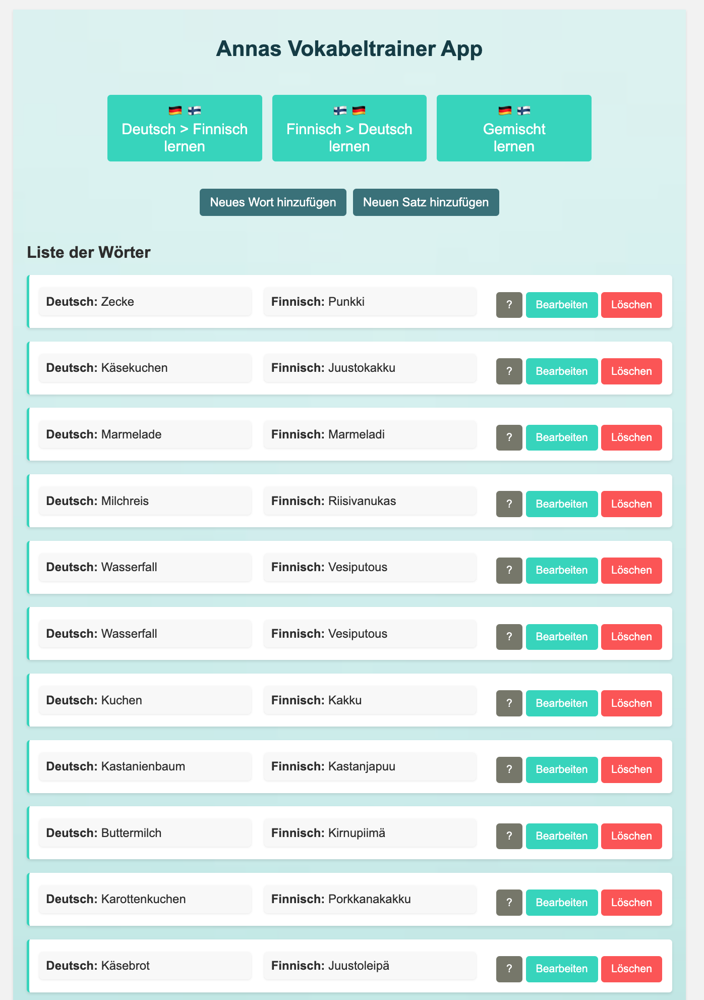
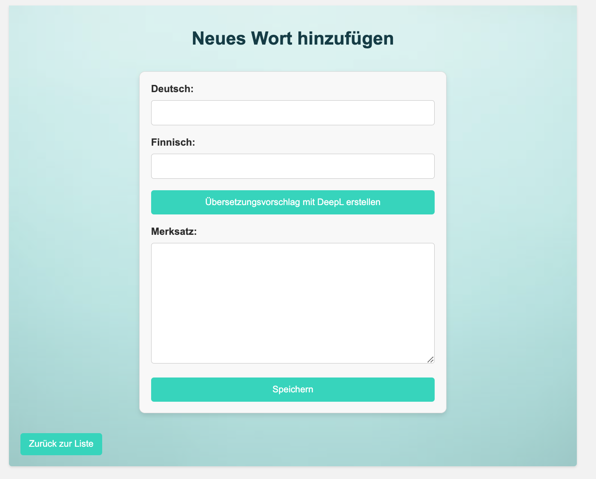

# Vokabeltrainer Projekt

## Beschreibung

Dieses Projekt ist ein einfacher Vokabeltrainer, der es Benutzern ermöglicht, Wörter und Sätze in zwei Sprachen (Deutsch und Finnisch) hinzuzufügen, zu bearbeiten und zu üben. Zusätzlich wird die DeepL API genutzt, um Übersetzungsvorschläge für die Eingabe von deutschen Wörtern zu erhalten.

## Features

	•	Hinzufügen, Bearbeiten und Löschen von Wörtern und Sätzen.
	•	Übungsmodi für Deutsch-Finnisch, Finnisch-Deutsch oder gemischte Vokabelübungen.
	•	Integration mit der DeepL API für Übersetzungsvorschläge.
	•	Benutzerfreundliches Webinterface mit ansprechendem Design.
	•	Speichern von Merksätzen zu jedem Wort oder Satz.

## Anforderungen

	•	Python
	•	Django
	•	SQLite
	•	DeepL API

## Start in VS Code

    •	Python3 manage.py runserver

### Vokabel Übungsmodus

### Startseite

### Eingabefeld

## Geplante Features

- Beim Vokabeltrainer Wörter selber eingeben als Antwort

- Multiple choice

- Listen gruppieren

- Verben - Konjugieren - Verb typen (im Finnischen gibt es 6 und 3 irreguläre)

- Login für mehrere Benutzer
